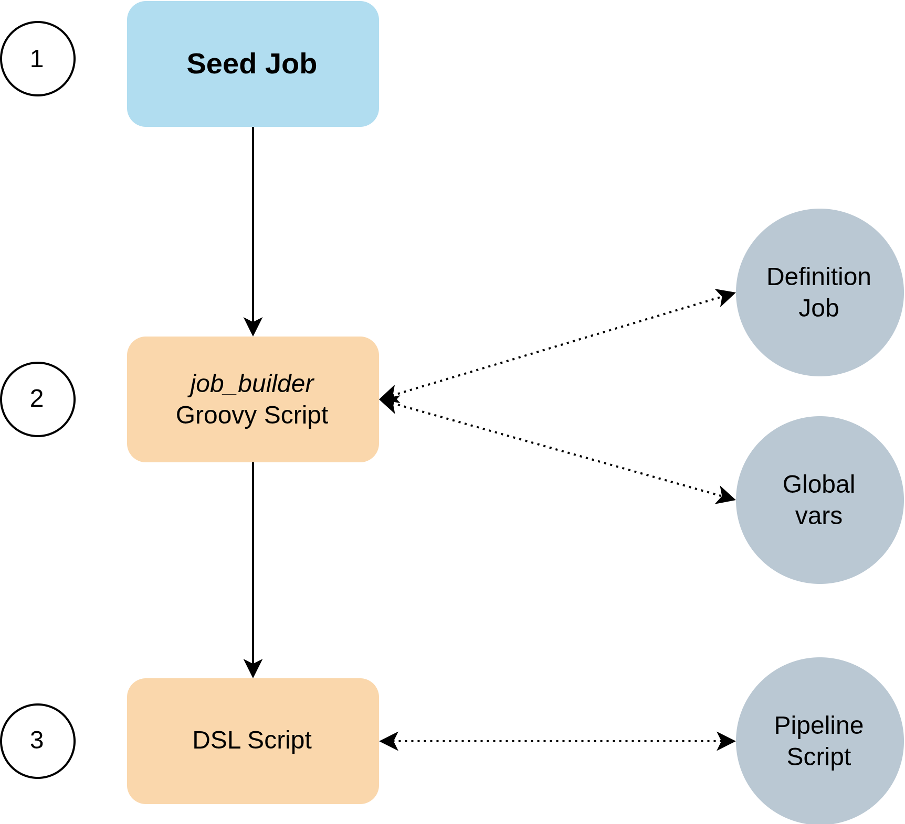

# EasyJobTemplating _4_ Jenkins

Welcome to the _EasyJobTemplating_ project!

Want to learn further on what this project is about exactly? <ins>Keep reading!</ins>

- [Motivation](#motivation)
- [Purpose](#purpose)
- [Architecture](#architecture)
- [Directory Structure](#directory-structure)
- [Jenkins Plugins and Languages](#jenkins-plugins-and-languages)
    - [Jenkins DSL Under The Hood](#jenkins-dsl-under-the-hood)
    - [Groovy](#groovy)
- [Get Started!](#get-started)

<br />

## Motivation

From long time ago, I've felt the necessity of automating the way we set up _repetitive_ jobs in Jenkins … and by _repetitive_ jobs I mean those that do the exact same thing but for different teams, departments, business units, and/or groups.

You may think: If they do the exact same thing, why can't you group them in a single job?

Short answer is:

* _Access control_: Not every member of a team needs or would be allowed to run certain jobs, or even make changes on jobs. So, by having separate job per team, organizations are able to put in place proper access control policies for them.
  
* _Customizations_: It'd be nice if you'd be able to make the jobs look different, or make them display different text while running the same logic begind the scenes, wouldn't it?

... <ins>Keep reading!</ins>

<br />

## Purpose

The _EasyJobTemplating 4 Jenkins_ project aims to ease the management of dozens, or hundreds, or even thousands of Jenkins jobs by setting up:

* A single Jenkins DSL script.
* A single Jenkins Pipeline script.
* And, a single Jenkins [Definition job](#definition-job) _per team / group / business unit / department_.

This one single _Definition job_ is all you need to get your teams up to speed.

But, once again, how does all this work? By following the _Object-oriented Paradigm_ ... <ins>Keep reading!</ins>

<br />

## Architecture

As previously stated, _EasyJobTemplating_ is made up of:

(a) A _Definition Job_ - This is, in reality, a _Groovy_ `vars` file containing the settings the target job will be created with. Through these settings (or _variables_), _EasyJobTemplating_ will know what Jenkins project to use, which DSL script to run, and which Pipeline script to add in.	
> [!NOTE]
> To clarify: Definition Jobs do not contain code of any kind, just settings that define a job.
>                 The sole existence of this file defines a job to create.

(b) A _single Jenkins DSL_ script - This is a regular Jenkins DSL script with some `Groovy` code embeeded to process the settings in the _Definition Job_.

(c) A _single Jenkins Pipeline_ script - This is a _Declarative_ Jenkins Pipeline that also processes the settings in the _Definition Job_.
<br />
<br />

But, ***there's also one last component that orchestrates the whole templating:***

(d) `job_builder.groovy` - This is a _Groovy_ script that gets called by the _seed_ job. It gets a list of the _Definition Jobs_ to process from the _seed_ job, and starts the job provisioning.

<br />
Take a quick look at this diagram:

<br />
<br />

<p align="center">
  
</p>

<br />

(1) The _seed_ job (a) is run with a list of _Definition Jobs_ as parameters.

(2) The _Groovy_ script (d) gets called by the _seed_ job:
* It gets parameters from the _seed_ job as input.
* It iterates through the list of _Definition Jobs_, and loads them. Since they're just variables, these variables tells (d) which _EasyJobTemplating_ project (i.e. `JOB_PARENT_PROJECT` variable) it belongs to, among other settings.
* By identifying the parent project, (d) also loads the parent project's _Groovy_ `vars` file which contains the global settings for the project. Each _Definition Job_ is just sub-set of its parent project's `vars` file, and if some variables match between the two, the ones in the _Definition Job_ takes precedence. In other words, this is a mechanism to override global settings.
  
(3) The _DSL_ script (b) gets called by the _Groovy_ script. The _DSL_ script is the one that actually builds the target Jenkins job. It also loads the _Declarative Pipeline_ script (c) to embeed it into the newly-built target job.

In essense, following the _Object-oriented Paradigm_:

> An EasyJobTemplating Definition Job (`object`) is an instance of an EasyJobTemplating Project (`class`)
>
> Although an EasyJobTemplating Definition Job encapsulates attributes from the EasyJobTemplating Project, it can also modify them while keeping the core logic defined in the Project.

<br />

## Directory Structure

The _EasyJobTemplating_ project has the following directory structure:

```

jobs/                                       --> Where Definition Jobs per group / team / business unit are located.
    +-- finance/                            --> Example for a `Finance` team.
    +-- marketing/                          --> Example for a `Marketing` team.
    +-- hr/                                 --> Another example for the `Human Resources` department.

projects/                                   --> EasyJobTemplating projects.
    +-- corporate-stats-monthly-report/     --> Example project.
        +-- scripts/                        --> This is where the Jenkins DSL and Jenkins Pipeline scripts are in.
        +-- vars/                           --> Here you'll find the `global` vars file for an EasyJobTemplating projects.
        +-- libs/                           --> Shared code that works as libraries for the projects and their scripts.
           +-- resources/                   --> Libraries for Jenkins resources.
           +-- src/                         --> Code libraries accessible by the project's scripts. 

```

<br />

## Jenkins Plugins and Languages

<br />

### Jenkins DSL Under The Hood

This project is based on [Jenkins DSL plugin](https://plugins.jenkins.io/job-dsl/)

Therefore, you'll need to set up a _seed_ job, or a series of seed jobs, to create your team's target jobs.

I'll show you exactly how to do it later on this documentation.

<br />

### Groovy

Scripts in this project have been written in [Groovy](https://groovy-lang.org/)

This includes:
* _Jenkins DSL script_ - It has `groovy` code in it to perform advanced processing and decisions.
* _Jenkins Pipeline_ - It also has `groovy` code in it.
* _job_builder.groovy_ - `groovy` script that orchestrates the whole templating process.

<br />

## Get Started!

### !! First off !!

Take a moment to look at the code of this project, read it through, study it … and **try it out!**

The current state of the repository has an example _EasyJobTemplating_ project called `corporate-stats-monthly-report` to get you started.

> [!IMPORTANT]
> Keep in mind that the _EasyJobTemplating_ project is flexible and customizable meaning you'd be able to:
>    - Add / Modify / Remove settings on the Definition Jobs and/or project's global `vars` file to adjust to your personal / business needs.
>    - Add / Modify / Remove code on the DSL and Pipeline scripts to adjust to your personal / business needs.
>
> By running the example `corporate-stats-monthly-report` project, you'll see how this works. Play around, and make changes to the code and settings!

<br />

Click [here](docs/get-started.md) to go to the _get started_ documentation.