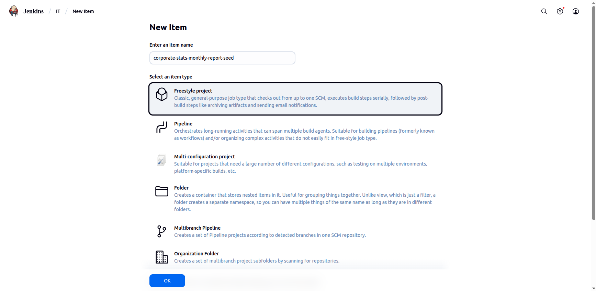
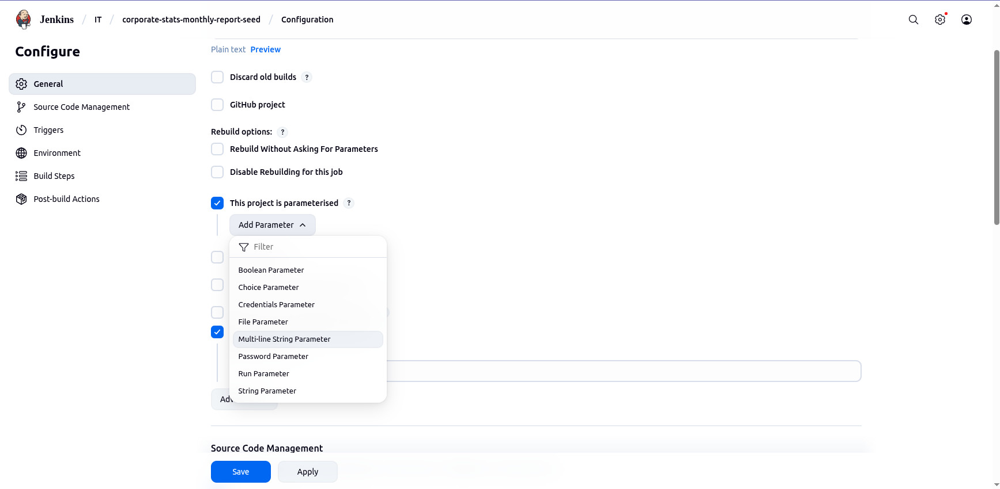
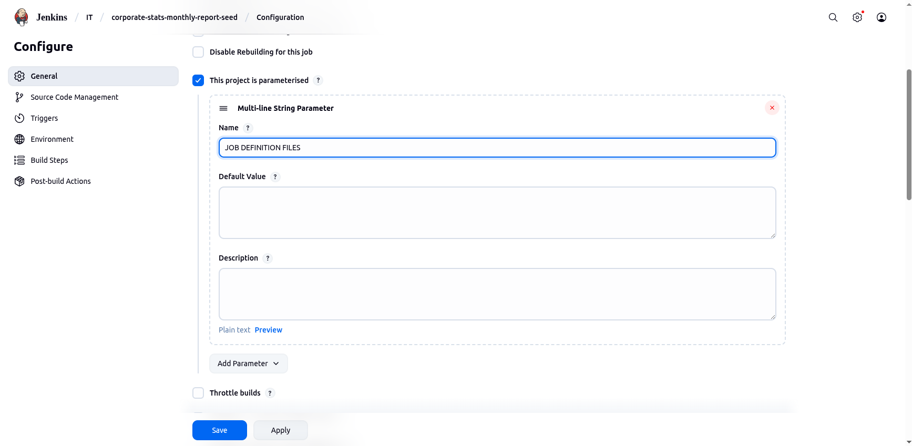
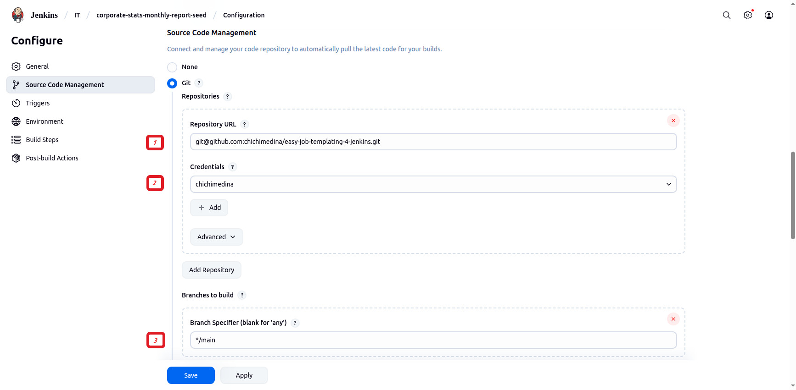
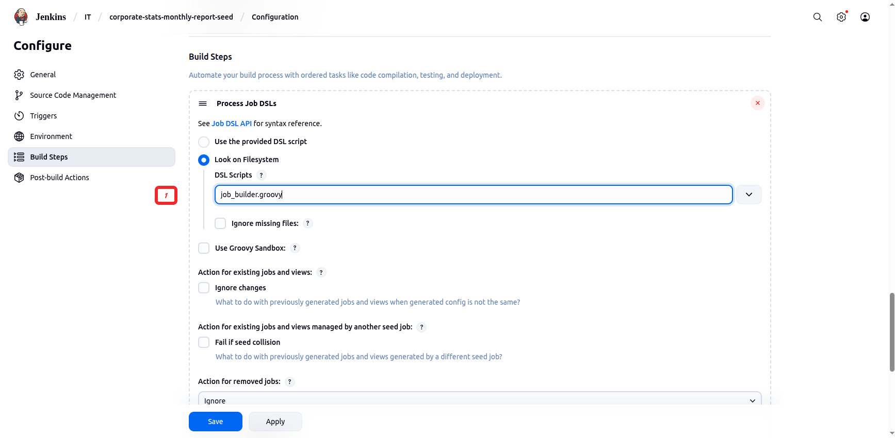
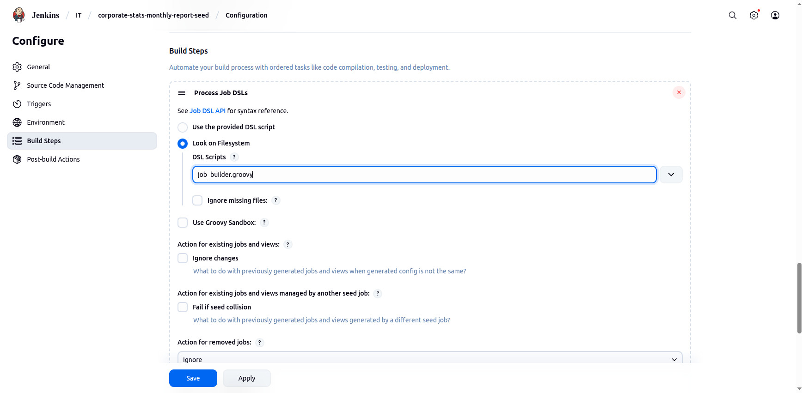
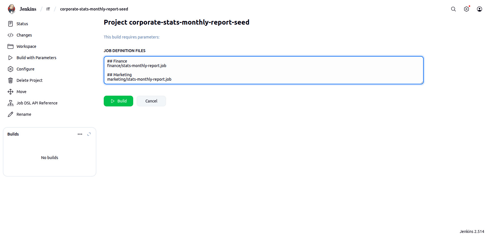
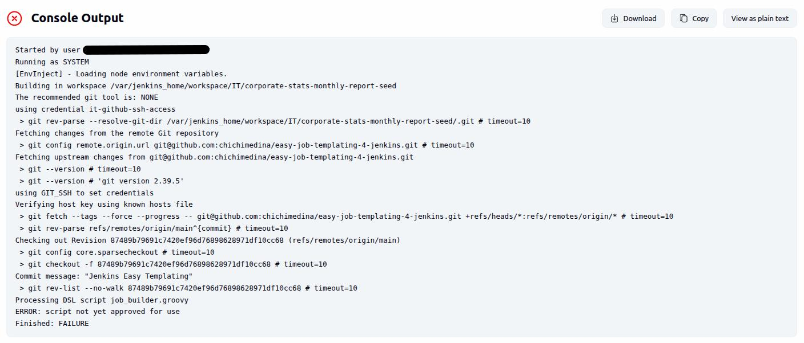

## Requirements

### Jenkins Plugins

- The following Jenkins plugins are dependencies for this project:
    - _Job DSL_ (https://plugins.jenkins.io/job-dsl)
    - _Environment Injector_ (https://plugins.jenkins.io/envinject)

### Jenkins Configuration

- Create a Jenkins Credentials object to host your GIT repository credentials (_SSH keys_, _passwords_, or _tokens_).
- Given the project example `corporate-stats-monthly-report`, we'll have to create three (3) Jenkins folders at the root level:
  - `Finance`
  - `Marketing`
  - `HR`

<br />

> [!NOTE]
> To understand this requirement, take a look at the `JOB_PATH` setting on the _Finance_, _Marketing_, and _Human Resources_ teams _Definition Jobs_:
> - [jobs/finance/stats-monthly-report.job](../jobs/finance/stats-monthly-report.job)
> - [jobs/marketing/stats-monthly-report.job](../jobs/marketing/stats-monthly-report.job)
> - [jobs/hr/stats-monthly-report.job](../jobs/hr/stats-monthly-report.job)
>
> The setting `JOB_PATH` points out where in your Jenkins instance the target job will be created in.

<br />

## Seed Job

Since the _EasyJobTemplating_ projects runs on top of the _Job DSL_ plugins, we'll need a _seed_ job or a series of _seed_ jobs (depending on your policies) to create the target jobs.

<br />

> [!NOTE]
> Remember: The target jobs are just the Jenkins jobs meant for your teams / groups / departments.


### Step #1

Create a new item of the `Freestyle project` type that will function as your _seed_ job in the Jenkins directory of your choice.

For the default project example on this repository, the _seed_ job will be called `corporate-stats-monthly-report-seed` (choose the name of your liking):

<p align="center">
  <kbd></kbd>
</p>

<br />

### Step #2

- Click on the `This project is parameterised` checkbox.
- Add a `Multi-line String Parameter` parameter.

<p align="center">
  <kbd></kbd>
</p>

<br />

### Step #3

- Set the name of this _Multi-line String Parameter_ to `JOB DEFINITION FILES`

<br />

> [!WARNING]
> This is a fixed static value for the seed job parameter.
> It's harcoded in the `job_builder.groovy` script, but you can always change it as you see fit on your fork.

<br />

<p align="center">
  <kbd></kbd>
</p>

<br />

### Step #4

Time to set up where to get the _EasyJobTemplating_ project code from:

<p align="center">
  <kbd></kbd>
</p>

[1] Go to the _Source Code Management_ section, click on the `Git` radio button and enter the URL of this repository or your fork's URL.

[2] Choose the Jenkins Credential object where the credentials (if any) for accessing this repository or your fork's repository is in.

<br />

> [!NOTE]
> This is the Jenkins Credentials object created as a Jenkins Configuration requirement.

<br />

[3] Make sure to enter the proper repository branch you want to run.

<br />

### Step #5

Go to the _Build Steps_ section, and:

- Click on the _add build step_ dropdown.
- Choose _Process Job DSLs_ from the dropdown.

<p align="center">
  <kbd></kbd>
</p>

<br />

### Step #6

- Once a _Process Job DSLs_ step has been added in, we need now to tell Jenkins the _DSL script_ that will process the _Definition Jobs_. This script is `job_builder.groovy`
- Click on _Save_ to complete the _seed_ job.

<p align="center">
  <kbd></kbd>
</p>

<br />

### Step #7

Time to run the _seed_ job!

To continue with the project example `corporate-stats-monthly-report`, we'll add the following entries as a parameters of the _seed_ job:

> [!NOTE]
> The syntax for this parameter is:
>
> Full path of a _Definition Job_ **in** the `jobs/` directory of the repository (without specifying the `jobs/` directory itself).

```
## Finance
finance/stats-monthly-report.job

## Marketing
marketing/stats-monthly-report.job
```

<br />

> [!TIP]
> - You can add references to multiple _Definition Jobs_, or separate out teams / groups / departments by setting up individual _seed_ jobs for each.
> - Entries that start with`#` will act as a comments, and will not be processed.

<br />

<p align="center">
  <kbd></kbd>
</p>

<br />

Click on _Build_ to create your first _EasyJobTemplating_ jobs!

<br />

### Step #8

> [!IMPORTANT]
> Depending on your security settings, the _seed_ job will fail because it needs to be approved by a Jenkins _administrator_ after:
>
> - The very first time you run your _seed_ job.
> - Making changes on the `job_builder.groovy` script.

Run the _seed_ job as admin, or ask your Jenkins admin to review it and approve it.

<p align="center">
  <kbd></kbd>
</p>

